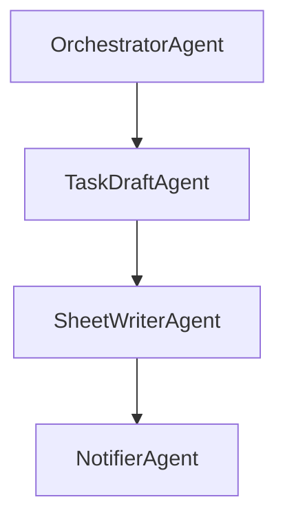

# ai_pm_agent_plan.md
*AI Project-Manager (Task-Creator) — Agents SDK edition*  
*Generated 2025-05-09*

---

## Executive Summary
This project delivers a **Slack-native AI Project-Manager** that turns ad-hoc meeting summaries into structured tasks and logs them to a Google Sheet. Built on the **OpenAI Agents SDK**, it composes three lightweight agents—**TaskDraftAgent**, **SheetWriterAgent**, and **NotifierAgent**—wired together by an *OrchestratorAgent*. Users simply drop a summary into a DM with the bot; within seconds they receive a confirmed task and the assignee gets pinged.

---

## 1 Why the Agents SDK?
* **Tiny surface area:** only `Agent`, `Tool`, and `Runner` primitives plus hand-offs—minimal boilerplate.  
* **Structured I/O:** Pydantic models guarantee each task row has all mandatory fields.  
* **Tracing out-of-the-box:** `OPENAI_TRACE=1` streams JSON traces for debugging.  
* **Easy orchestration:** hand-off helpers let one agent call the next without bespoke glue code.  
* **Infra-agnostic:** same code runs locally, in Docker, or on Railway without changes.

---

## 2 High-Level Architecture (Agent Graph)



| Agent | Purpose | Core tools | Guardrails |
|-------|---------|-----------|------------|
| **TaskDraftAgent** | Turn raw summary into `Task` object | OpenAI LLM (json schema) | Empty fields rejected |
| **SheetWriterAgent** | Append task to Google Sheet | `GSheetAppendTool` | Retry on 5xx |
| **NotifierAgent** | DM assignee the new task link | `SlackPostTool` | Rate-limit 1 msg/s |
| **OrchestratorAgent** | Handle incoming Slack events, chain hand-offs | — | Logs every hand-off |

---

## 3 Task Schema

```python
class Task(BaseModel):
    title: str
    description: str
    assignee: str          # Slack @handle or email
    due_date: Optional[str]  # ISO date, '' if not provided
    priority: Literal["P0","P1","P2"]
    source_channel: str    # Slack channel id
    sheet_row: Optional[int] = None  # filled by SheetWriterAgent
```

Mandatory fields: Title, Description, Assignee, Priority.

---

## 4 Data & Integration Layer
* **Google Sheet:** existing sheet `https://docs.google.com/spreadsheets/d/<SHEET_ID>`; columns in schema order.  
* **Slack App:** bot scopes `commands,chat:write,channels:history,im:history`.  
* **Secrets:** `.env` with `OPENAI_API_KEY`, `SLACK_BOT_TOKEN`, `GOOGLE_SERVICE_JSON`.  
* **Observability:** traces streamed to console and optionally Langfuse.  
* **Storage:** no database for v1—Sheet is system-of-record.

---

## 5 Development Roadmap (8 weeks)

| Week | Milestone | Key tasks |
|------|-----------|-----------|
| 0 | **Env + Repo bootstrap** | Venv, install `openai-agents`, initialise GitHub repo |
| 1 | **Slack listener MVP** | Create Slack app, event subscription, echo bot |
| 2 | **TaskDraftAgent** | Prompt & Pydantic schema; unit tests |
| 3 | **SheetWriterAgent** | Wrap Google Sheets API, append row, retry logic |
| 4 | **NotifierAgent** | DM assignee with link & task JSON |
| 5 | **OrchestratorAgent** | End-to-end hand-offs, happy-path integration test |
| 6 | **CI/CD & tracing** | GitHub Actions, Dockerfile, `OPENAI_TRACE` |
| 7 | **Hardening & docs** | README, security checklist, stakeholder demo |
| 8 | **Buffer / stretch** | Extra guardrails, multi-task summaries |

---

## 6 Sample Code Snippet

```python
from agents import Agent, Runner, tool
from pydantic import BaseModel

class Task(BaseModel):
    title: str
    description: str
    assignee: str
    due_date: str | None
    priority: str

@tool
def append_to_sheet(task: Task) -> int:
    """Write task to Google Sheet; return created row number."""
    ...

sheet_writer = Agent(
    instructions="Receive a Task and write it to Google Sheet via append_to_sheet.",
    tools=[append_to_sheet],
    input_type=Task,
    output_type=int,
)

result = Runner.run_sync(sheet_writer, Task(...))
print("Row:", result)
```

---

## 7 Future Extensions
1. **Vector-memory of closed tasks** for duplicate detection.  
2. **ClassificationAgent** to auto-assign priority based on wording.  
3. **GitHub Issues sync** to open tasks directly in code repos.  

*Last updated 2025-05-09*
